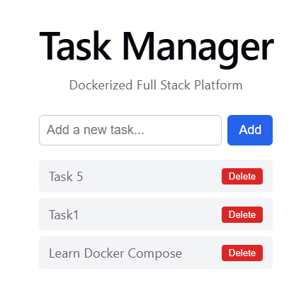
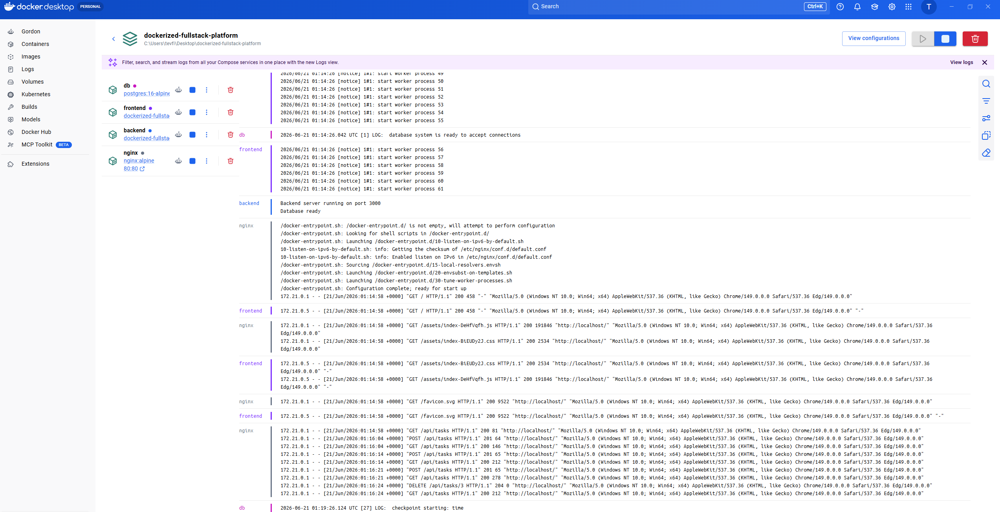
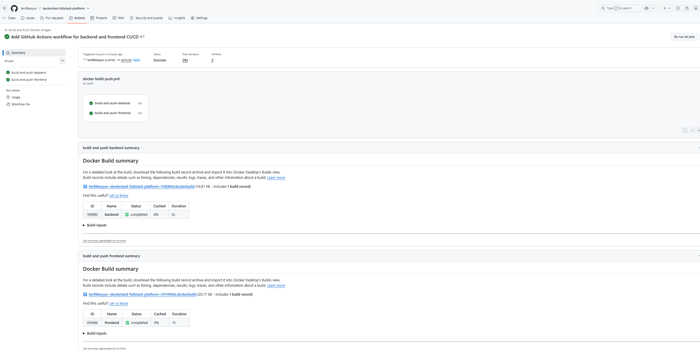
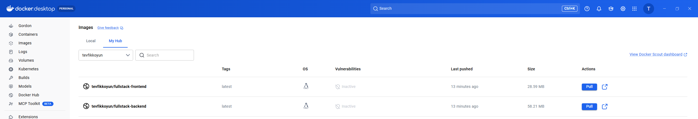

# Dockerized Full Stack Platform

A production-style, containerized full-stack application — a Task Manager built with React, Node.js/Express, and PostgreSQL, served behind an Nginx reverse proxy, orchestrated with Docker Compose, and deployed via an automated GitHub Actions CI/CD pipeline.

This project is the capstone of a [12-lab Docker learning series](https://github.com/tevfikkoyun/docker-mastery-labs), applying every concept covered there — multi-stage builds, custom networks, healthchecks, secrets management, and CI/CD — to a single, real working system.



## Architecture

```
                         ┌─────────────────────────┐
                         │      Nginx (port 80)     │
                         │      reverse proxy       │
                         └────────────┬──────────────┘
                                      │
                  ┌───────────────────┼───────────────────┐
                  │ "/" → frontend     │  "/api/" → backend │
                  ▼                                       ▼
        ┌──────────────────┐                   ┌──────────────────────┐
        │     frontend       │                   │       backend         │
        │  React (static,    │                   │  Node.js / Express    │
        │  served by Nginx)  │                   │  CRUD API             │
        └──────────────────┘                   └───────────┬──────────┘
                                                              │
                                                              ▼
                                                  ┌──────────────────────┐
                                                  │          db            │
                                                  │  PostgreSQL            │
                                                  │  (named volume,        │
                                                  │   persists data)       │
                                                  └──────────────────────┘

        All four services communicate over a private Docker Compose
        network and resolve each other by service name (no hardcoded IPs).
```

Only Nginx is exposed to the host (port 80). The backend and database are reachable solely from inside the Docker network — neither has a published port — mirroring how a real production deployment isolates internal services from direct external access.

## Stack

| Layer | Technology |
|---|---|
| Frontend | React (Vite), built to static files, served by Nginx |
| Backend | Node.js / Express, REST API |
| Database | PostgreSQL 16 (alpine) |
| Reverse Proxy | Nginx |
| Config | `.env` file, excluded from version control |
| Orchestration | Docker Compose |
| Persistent Data | Docker named volume (`db-data`) |
| Network | Private custom bridge network |
| CI/CD | GitHub Actions → Docker Hub (parallel backend/frontend build & push) |

## Running locally

1. Clone the repo and create a `.env` file in the project root:
   ```
   DB_USER=postgres
   DB_PASSWORD=your_password_here
   DB_NAME=fullstack_db
   ```
2. Start everything:
   ```
   docker compose up --build
   ```
3. Open `http://localhost` — no port needed, Nginx serves on port 80.

The database schema (a `tasks` table) is created automatically on first boot by the backend, with a retry loop in case the database isn't ready yet on startup.

## What's running, live

Four services — `db`, `backend`, `frontend`, `nginx` — running together via `docker compose up`, with live request logs flowing through the reverse proxy to the backend API (`POST`, `GET`, `DELETE` requests all visible going through Nginx → backend):



## CI/CD pipeline

Every push to `main` triggers a GitHub Actions workflow with two parallel jobs — one builds and pushes the backend image, the other the frontend image — both completing in well under 30 seconds total:



Both images land on Docker Hub automatically, no manual `docker push` required:



Credentials are stored as GitHub repository secrets (`DOCKERHUB_USERNAME`, `DOCKERHUB_TOKEN`) and never appear in the workflow file or application code.

## Design decisions worth noting

- **Backend uses a connection pool (`pg.Pool`), not a single client.** A web server handling concurrent requests needs the pool's connection management — a single persistent client (used in earlier labs for simplicity) doesn't scale to multiple simultaneous requests.
- **A dedicated `/health` endpoint never touches the database.** An earlier lab in this series (Lab 12 of the prerequisite series) surfaced a real bug where a health check hanging on a failed database query made a container falsely report as down. This project's backend tracks a `dbReady` flag and fails fast with a `503` instead of letting requests hang if the database isn't connected yet.
- **The frontend never hardcodes the backend's address.** It calls `/api/tasks` — a relative path — and lets Nginx route it internally. This means the frontend code has zero knowledge of where the backend actually lives, which is what makes the reverse proxy pattern useful in the first place.
- **The backend and database have no published ports.** Only Nginx is reachable from the host. This is a deliberate, minimal step toward the principle of least exposure — internal services should never be reachable directly if a proxy is meant to front them.
- **Database retries on startup.** If PostgreSQL isn't ready the instant the backend starts, `initDb()` retries every 3 seconds rather than crashing — a more resilient pattern than relying solely on `depends_on` healthchecks (which this project also uses, as defense in depth).

## Repository structure

```
.
├── backend/              # Node.js/Express API, Dockerfile
├── frontend/              # React app (Vite), Dockerfile
├── nginx/                 # Reverse proxy configuration
├── docker-compose.yml     # Orchestrates all four services
├── .env.example            # Template for required environment variables
└── .github/workflows/      # CI/CD pipeline definition
```

## Related project

This project builds directly on [docker-mastery-labs](https://github.com/tevfikkoyun/docker-mastery-labs), a 12-lab series covering Docker fundamentals through production-ready practices — multi-stage builds (8x image size reduction demonstrated), custom networking, environment/secrets management, debugging methodology, and vulnerability scanning with measured before/after results.